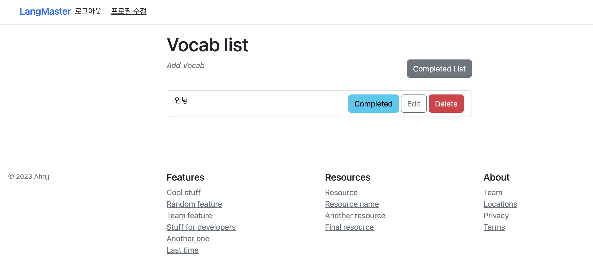
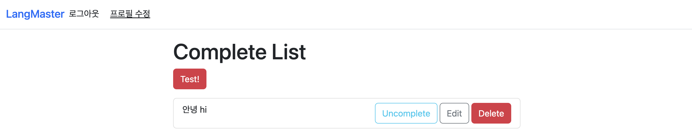
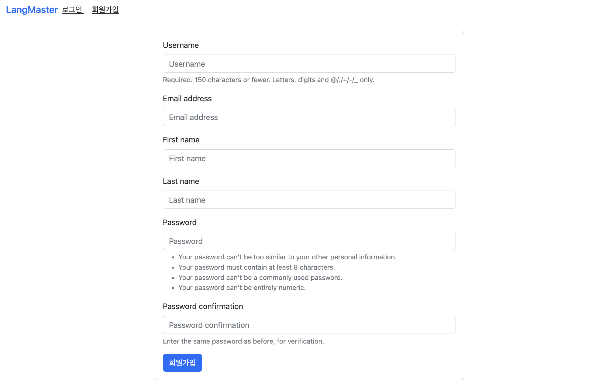
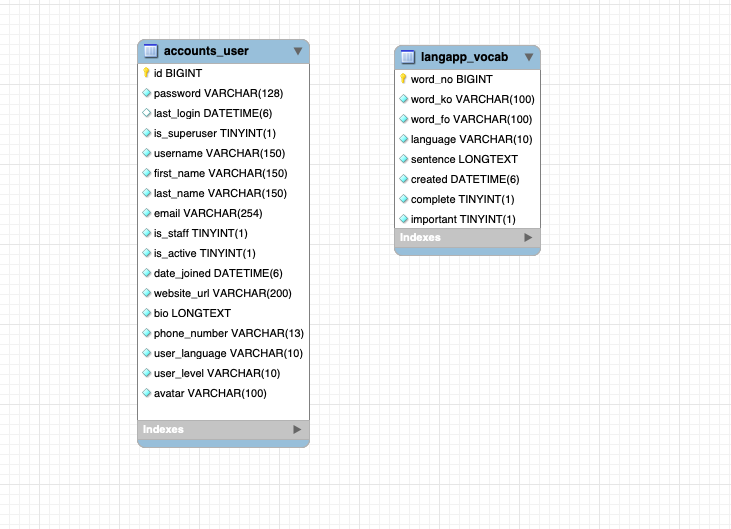
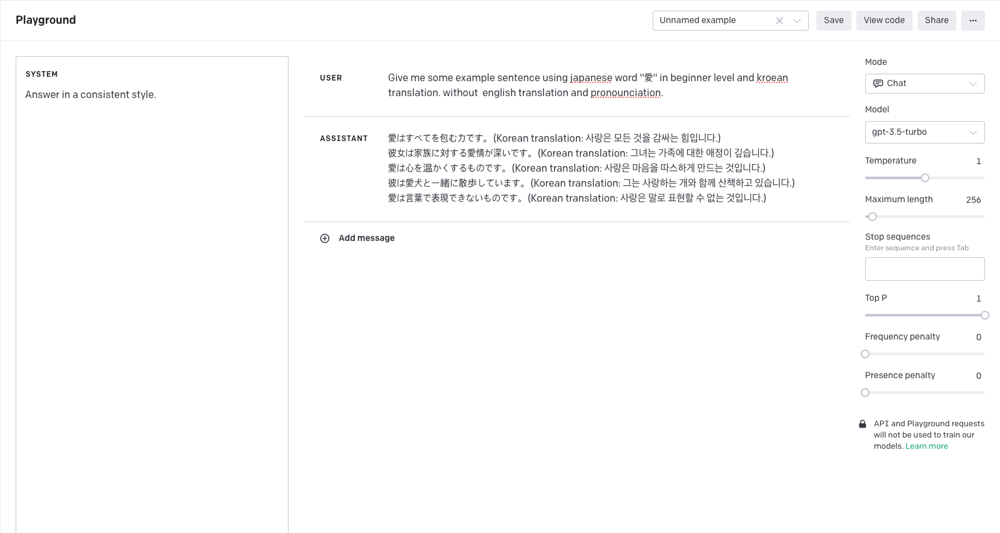

# Language Master

## `App`

---

[Language Master](https://langmaster-b78b770cee7c.herokuapp.com/langapp/)

## Tool

- Front : Jquery, Javascript, bootstrap
- DB : mysql
- Backend : django, python
- openai, beautifulsoup
- deployment : heroku
    
    
    ### 단어 전체 조회
   
    
    
    ### 상세 단어 조회
    
    .png)
    
    ### 단어 등록
    
    .png)
    
    .png)
    
    ### 완료
    
    
    
    ### login / logout
    
    .png)
    
    ### 회원가입
    
    
    
    ### 프로필 수정
    
    .png)
    
    ---
    
    ## ERD
    
    ---
    
    
    

---

## Function

---

1. 유저/profile 
    1. 이름, 학습언어, 레벨, 아바타사진, bio, web_link
2. 단어장 - 로그인 필수
    - 기본 단어장 CRUD 기능
        - 단어 / 해당 외국어 단어(번역된 것) / 예문 추천 (chatGPT) / 완료 여부 / 중요여부
    
    ### 구글 번역 기능 크롤링해서 입력한 단어 자동 번역
    
    - 구글 번역기 (모바일창) 크롤링
    - 영어, 일본어, 중국어, 스페인어, 프랑스어, 러시아어, 독일어
    1. **번역 기능**
    - 한국어 단어 입력시 자동 해당 언어로 번역해서 단어 저장
    1. **form 수정(단어 자동 번역)**
    
    ```python
    def clean(self):
            word_ko = self.cleaned_data.get('word_ko')
            word_en = self.cleaned_data.get('word_fo')
            target = self.cleaned_data.get('language')
            if word_ko and not word_en:   # 한국어 단어는 입력되었으나 영어 단어 입력이 안되어있을 경우 단어 번역해서 저장
              self.cleaned_data['word_fo'] = self._translate(word_ko,target)
    
    @staticmethod
    def _translate(origin_text:str,target) -> str:
        # language
        lang_list = {
            "English" : "en",
            "en-US" : "en",
            "Japanese" : "ja",
            "ja-JP" : "ja",
            "Chinese" : "zh",
            "zh-CN" : "zh", 
            "Spanish" : "es",
            "es-ES" : "es",
            "French" : "fr",
            "fr-FR" : "fr",
            "German" : "de",
            "de-DE" : "de",
            "Russian" : "ru",
            "ru-RU" : "ru"
        }
        language = lang_list[target]
        translated = google_translate(origin_text, "auto", language)
        if not translated:
            raise forms.ValidationError("Cannot translate")
        return translated
    ```
    
    ### chatgpt에게 예문 추천 받기
    
    - **GPT Prompt**
    
    ```python
    Give me some example sentence using {언어} word {단어} in {레벨} level and korean translation.
    Without english translation and pronounciation.
    ```
    
    
    
    ### 시도1. 예문 추천 여부 안받고 예문 미입력시 자동으로 추천해주는 상황
    
    - ~~openai 무료 토큰을 모두 사용해서 재 시도 해봐야함~~
    1. gpt 쿼리 받는 함수
    
    ```python
    # 유저가 날리는 메세지
    user_prompt = f'Give me one example sentence using {language} word {vocab} in advanced level and korean translation.\
                        Without english translation and pronounciation.'
    ```
    
    ```python
    # gpt 응답 받기
    response = openai.ChatCompletion.create(
            model = 'gpt-3.5-turbo',
            messages=[
                    { "role": "system", "content": "Answer in a consistent style." },
                    {  "role": "user", "content": **user_prompt** }
            ],
            temperature = 1, # 온도인자: 1 에 가까울 수록 그때 그때 다른 답을 준다. - openai제공
        )
    assistant_message = response["choices"][0]["message"]["content"]
    ```
    

## Challenge

---

1. 구현
- 1차적으로 기본 기능 (CRUD, 자동번역)기능을 완료 한 이후,  추가적으로 기능들을 추가하려는데, 하나 손을 대면 다 꼬일것 같았다.
- 처음에는 기본 CRUD기능부터 구현한후, 유저 기능(인증, 로그인, 등)을 이후 구현했다.
- 각 유저별로 고유한 단어장 페이지를 보여주고 싶어서, 다시 모델을 구현한 이후 업데이트 해볼 것이다.
2. DB설계
- 사용자 마다 각자의 단어장 페이지를 보여주도록 하기 위해, 모델을 어떻게 설계할 것인가가 가장 고민이었다.
- 입력한 모든 단어의 단어 번호 pk 로 user_no fk로 필터링 하는 방법 : 사용자마다 중복되는 단어가 늘어날수록 방대한 데이터베이스가 되어버린다.
- 중복되는 단어 없이, 단어에 추가한 user list 에 user_no로 필터링한다.
3. deployment
- 어떤 플랫폼을 이용할지 부터 고민이었다. 배포 경험이 처음이기 때문에, 복잡하게 많은 것을 배우는 것보다는 이번에는 ‘로컬이 아닌곳에서 사용가능한 나의 앱’ 이 목표로 두고 비교적 사용하기 쉬운 것을 고르는것. 그리고 앞으로 장기적으로 배울것도 생각해서 AWS Elasticbean / Heroku 중에 고민했다. 둘다 가입한 직후에는 무료이지만. heroku는 그때그때 수정해서 바로 사이트에 반영하기가 덜 번거로워서 헤로쿠로 진행했다.
4. 과금
- OpenAI의 API를 사용해서 문장 추천기능을 사용하고자 구현했으나 개발도중 유료로 서비스가 전환되었다.
- 배포 테스트를 하다가 모르는 사이에 과금이 되고있었다는 것을 알게되었다.
5. 마주한 많은 에러들
- 장고 전용 에러집을 만들 정도로 다양한 에러들을 만나서, 하나하나 해결해가며 해결법을 배울 수 있었다.


### 개선 점, 추가로 구현할 점

1. 사용자 개개인 별 고유한 단어장
2. 단어 검색 기능
3. 커뮤니티 
    1. 정보제공
    2. 질문
4. 게임
    1. 선지형 맞추기 (일일도전) - 레벨 별로
    2. chatGPT 와 외국어로 대화하기