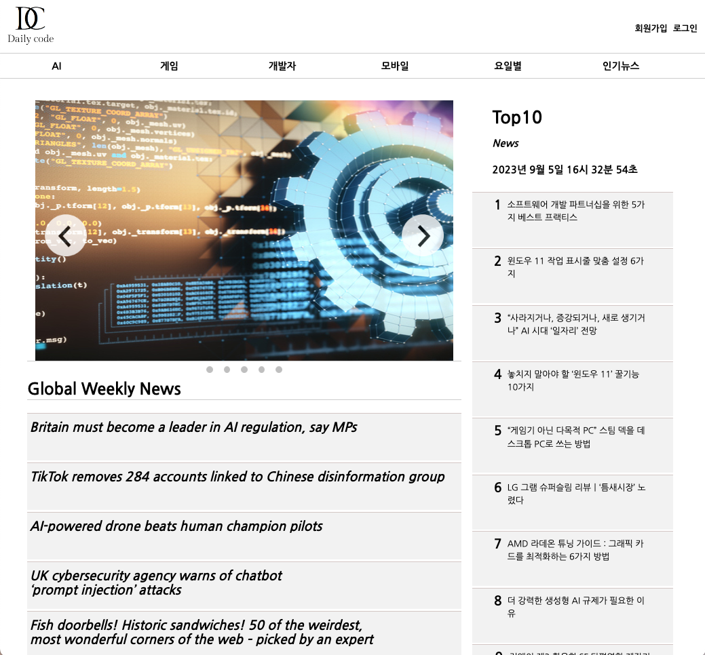
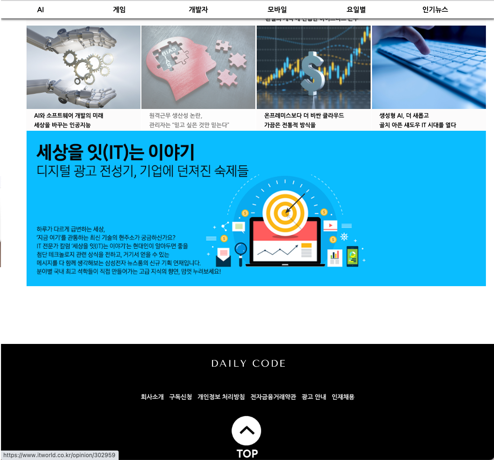
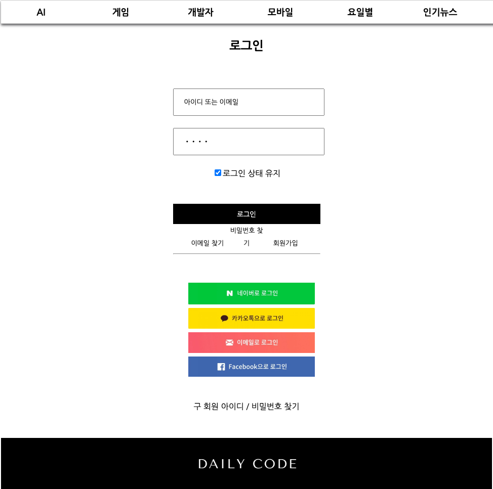
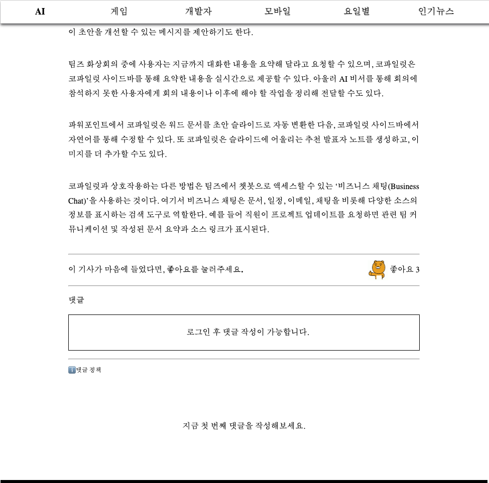
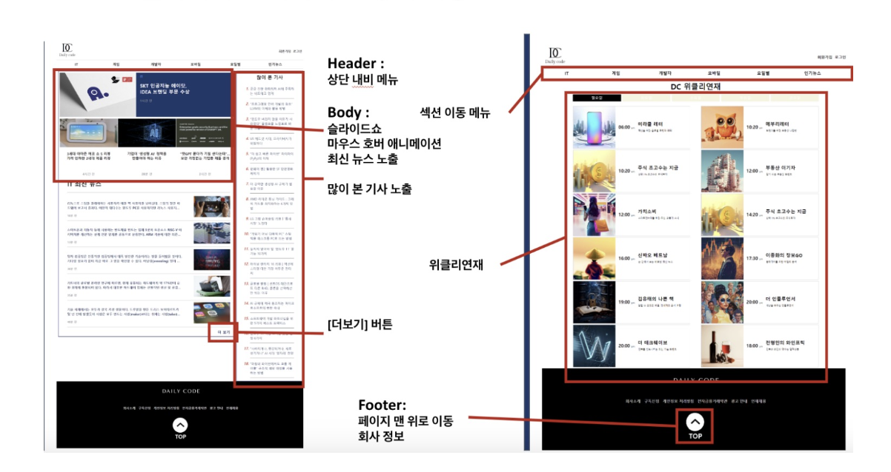

# Frontend project - News Site

[https://github.com/ahnjj/News-site](https://github.com/ahnjj/News-site)

### Award

multicampus AI백엔드 과정 프론트엔드 프로젝트 1위

---

## Web Page

### Main page

### Login/Join

회원가입 및 로그인 유효성 검사

### 개별 기사 페이지

- 댓글 창 - 로그인 필수
- 좋아요 기능
    
    
    

### 사이드 페이지

- 섹션별 기사
- 요일별 기사
    - 요일별로 클릭하면 기사 목록이 바뀐다.

---

### 🎬 프로젝트 배경

### 👋🏻 담당역할

- **팀리더**
    - 전체 레이아웃 설계 및 전체 총괄
    - 메인 페이지 화면 구현, 로그인 및 회원가입 유효성 기능 구현

### 📒프로젝트 수행 절차

### 웹 페이지 계층 구조

### 📍 사용한 기술스택

- javascript
- jQuery
- HTML
- CSS

---

### 📍느낀점, 개선할 점, 특히 팀 리더로서 느낀점

- 팀 리더로서 프로젝트의 진척 상황을 확인함과 동시에 개인 개발을 진행해야하는 점이 쉽지 않았다.
하지만 팀원 대부분이 개발이 처음인데도 불구하고 모두가 열정적으로 프로그램과 코드 개선에 참여해주었기 때문에 짧은 시간 내에 마무리할 수 있었다. 
개인 작업과 팀 프로젝트의 어려움(코드의 일관성 및 의견 조율)과 좋은점(역량성장, 결과물의 질)을 동시에 경험 할 수 있었다.
- 팀원 모두가 가지고 있는 역량이 어느 정도 되는지를 알 수 없어 역할을 배분하는 것이 처음에 어려웠다. 프로젝트를 막상 진행하면서 각자의 역할이 자연스럽게 배분되었었지만, 먼저 파악한 상태에서 시작했더라면 한 기능이 과하게 지체되거나 하는 문제를 막을 수 있었을 것이다.
- 긴장과 스트레스 상황에서 어떻게 서로가 비난하지 않고 각자의 역할에 집중하고 협력할 수 있는 분위기를 만드는 것 또한 팀장의 역할임을 깨달았다.
- 나 또한 개발 실력이 매우 뛰어난 것이 아니기 때문에, 맡은 부분을 구현하는데 더 집중해서 시간이 필요했었다. 하지만 프로젝트 전반적인 진척상황을 파악해야한다는 생각에 차분히 집중하지 못해 개인적인 개발을 많이 못했다. 이점이 아쉬웠지만, 점점 경험이 쌓여가면서 조절하는 실력도 늘겄이다.
- 백엔드 개발자로서 구현해내지 못한 기능들이 아쉬워서, 유효성 검사 및 보안 등 세부적인 기능들을 더욱 붙여서 프로젝트 완성도를 높이고 싶다.

### 🎬 발표자료

[DailyCode.pdf](readme_image/DailyCode.pdf)